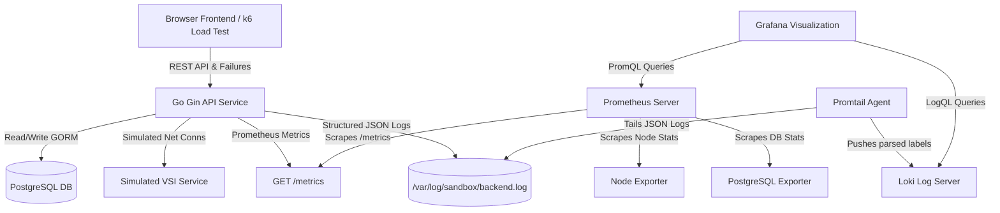

# Sandbox Observability Platform

The **Sandbox Observability Platform** is a production-style, containerized full-stack application designed to demonstrate backend, frontend, database, and infrastructure observability. It serves as an enterprise-level demo for monitoring, distributed logging, performance telemetry, and system saturation analysis using Prometheus, Grafana, Loki, Promtail, PostgreSQL, and Docker.

Intentionally built to demonstrate the **Four Golden Signals** (Latency, Traffic, Errors, and Saturation), the platform exposes deep HTTP and Database performance hooks and includes dedicated failure simulation controllers to stress the system and verify alerting paths.

---

## 🏗️ Project Architecture & Data Flow



### Port Layout
- **Frontend App**: `http://localhost:3000` (Served via Nginx)
- **Backend API**: `http://localhost:8080` (Go Gin application)
- **Grafana Console**: `http://localhost:3001` (User: `admin` / Password: `admin`)
- **Prometheus Scraper**: `http://localhost:9090`
- **PostgreSQL Database**: `localhost:5432` (Database: `sandbox_db`)
- **Postgres Exporter**: `http://localhost:9187`
- **Node Exporter**: `http://localhost:9100`
- **Loki Log Server**: `http://localhost:3100`

---

## 📁 Repository Structure

```
backend/
  cmd/
    main.go                   # Bootstraps Gin engine, registers metrics, & handle shutdowns
  configs/
    config.go                 # Dynamic environment variable loader
  internal/
    api/
      handlers/
        health.go             # Database-aware health-checks
        sandbox_handler.go    # Sandbox CRUD & remote terminal execution controllers
        simulate_handler.go   # CPU, RAM, Latency, and Error simulation controls
      middleware/
        middleware.go         # RequestID, CORS, Logging, Prometheus, Timeout & Rate limits
      models/
        models.go             # GORM GORM database entities definitions
      services/
        failure_service.go    # Dynamic state manager for simulating issues
        vsi_service.go        # Mimics infrastructure latency & error-rates
    database/
      db.go                   # GORM connection manager with automatic retry loops
      telemetry_plugin.go     # Custom GORM query callbacks & pool trackers
    logger/
      logger.go               # Uber Zap JSON multi-writer log aggregator
    metrics/
      metrics.go              # Time-series Prometheus vector registrations
  Dockerfile                  # Multi-stage compile configuration

frontend/
  src/
    App.tsx                   # React client (SVG charts, remote shell, failure switches)
    index.css                 # Premium custom HSL theme configuration
    main.tsx                  # Standard React DOM mount
  nginx.conf                  # Static files Nginx routing config
  Dockerfile                  # Build compiler & static runtime configuration

monitoring/
  prometheus/
    prometheus.yml            # Scrape targets for Go, Node, Loki & PostgreSQL
  loki/
    loki-config.yml           # Log indexing & storage configuration
  promtail/
    promtail-config.yml       # JSON parse stages & label extraction maps
  grafana/
    dashboards/               # 5 JSON pre-built dashboard templates
    provisioning/             # Datasources and Providers auto-loader config

load-testing/
  k6-script.js                # Scenario tests modeling traffic bursts and failures
  postman-collection.json     # Importable request lists for manual endpoint testing

docker-compose.yml            # System orchestrator
```

---

## 🛠️ Getting Started

Everything runs on a single command. Ensure you have **Docker** and **Docker Compose** installed.

### Start the Platform
```bash
docker compose up --build
```

### Stop the Platform
```bash
docker compose down -v
```

---

## 📡 REST API Documentation

### System & Telemetry
- `GET /health`: Checks database connectivity. Returns `200 OK` if database is connected, or `500 Internal Server Error`.
- `GET /metrics`: Standard Prometheus time-series metrics dump.

### Sandbox Management
- `POST /sandbox`: Create a new sandbox workspace.
  - Body: `{"sandbox_name": "dev-sandbox", "owner": "admin@enterprise.com"}`
- `GET /sandbox`: Lists all registered sandboxes.
- `GET /sandbox/:id`: Get a specific sandbox environment.
- `DELETE /sandbox/:id`: Delete a sandbox and purge its local logs.

### VSI Connectivity (Simulated Infrastructure)
- `POST /sandbox/:id/connect`: Simulates an infrastructure connect action.
  - Returns connection times and latency logs.
  - Connection rolls: 70% immediate success, 20% delay (5-10 seconds), 10% connection refused error.
- `POST /sandbox/:id/disconnect`: Disconnects VSI. Updates status to `STOPPED`.
- `POST /sandbox/:id/run-command`: Run bash commands on running sandboxes.
  - Body: `{"command": "df -h"}` (or `"fail"` to trigger a command failure).
- `GET /logs`: Scrape audit log traces stored in the PostgreSQL `sandbox_logs` table.
  - Query Filters: `?sandbox_id=1` or `?level=ERROR`.

---

## 💥 Failure Simulation Guide

The application features dedicated simulation endpoints that allow developers to induce real failures dynamically. You can trigger them from the **Failure Simulation tab** on the frontend Dashboard:

| Endpoint | Payload Example | Impact |
| :--- | :--- | :--- |
| `POST /simulate/api-delay` | `{"delay_ms": 2500}` | Adds `2500ms` delay to all API requests. Visualized immediately on Dashboard graphs. |
| `POST /simulate/db-delay` | `{"delay_ms": 1500}` | Sleeps GORM query callbacks, creating database-level slow queries. |
| `POST /simulate/db-failure` | `{"enable": true}` | Intercepts SQL calls inside GORM before callbacks, causing queries to fail (HTTP 500s). |
| `POST /simulate/vsi-timeout` | `{"enable": true}` | Forces VSI connections to hang for 6 seconds and return timeout errors. |
| `POST /simulate/high-cpu` | `{"enable": true}` | Spawns 4 worker threads running heavy arithmetic loops, locking host CPU graphs. |
| `POST /simulate/high-memory` | `{"megabytes": 150}` | Appends 150MB of byte blocks inside the Go memory leak pool. |
| `POST /simulate/random-errors` | `{"enable": true}` | Intercepts HTTP requests, returning random 500 statuses on 25% of traffic. |

---

## 📈 The Four Golden Signals

This project is built to demonstrate the **Four Golden Signals**:

### 1. Latency
- **Tracked metrics**: `http_request_duration_seconds` and `db_query_duration_seconds`.
- **How to test**: Toggle `/simulate/api-delay` or `/simulate/db-delay` and observe latency shifts.

### 2. Traffic
- **Tracked metrics**: `http_requests_total` and `http_requests_in_progress`.
- **How to test**: Run the `k6` load test script to generate request rate surges.

### 3. Errors
- **Tracked metrics**: `http_request_errors_total` and `db_query_errors_total`.
- **How to test**: Toggle `/simulate/db-failure` or `/simulate/random-errors`.

### 4. Saturation
- **Tracked metrics**: `process_cpu_seconds_total`, `process_resident_memory_bytes`, `go_goroutines`, and `active_database_connections`.
- **How to test**: Trigger CPU stress or memory leaks via the simulation tab.

---

## 📊 Pre-Provisioned Grafana Dashboards

Grafana automatically loads 5 dashboards on startup:

1. **Dashboard 1: Backend APIs**: Visualizes Golden Signals (throughput rates, concurrency, latencies, and HTTP response codes).
2. **Dashboard 2: Database**: Displays GORM query counts, SELECT/INSERT/UPDATE/DELETE latency times, query errors, and slow queries.
3. **Dashboard 3: Infrastructure**: Details machine-level states (node CPU, physical memory) and Go runtime stats (heap size, goroutines, OS threads).
4. **Dashboard 4: VSI Monitoring**: Tracks connectivity success percentages, connect latency, and connection failures.
5. **Dashboard 5: Loki Logs Console**: Integrates Loki log streams with text filter queries and index searches by **Request ID**.

---

## 🧪 Load Testing with k6

Generate traffic spikes and failure charts using **k6**:

1. Install k6 locally ([k6 installation guide](https://k6.io/docs/get-started/installation/)).
2. Execute the load script from the repository root:
   ```bash
   k6 run load-testing/k6-script.js
   ```
This script will ramp up virtual users, generate CRUD activity on the database, spin up commands, trigger connection attempts, and simulate brief CPU spikes, query failures, and network latencies.

---

## 🔍 Troubleshooting

### Container Connection Refused
Ensure PostgreSQL has completed startup before sending API requests. The Go backend container uses a built-in database ping retry logic that sleeps for 3 seconds between attempts. It will wait up to 30 seconds for PostgreSQL to accept connections.

### Logs do not appear in Loki
Check Promtail log inputs. Promtail is configured to scrape the named volume `/var/log/sandbox/backend.log`. Verify the volume mounting configurations in `docker-compose.yml` if logs fail to load in Loki.

### Grafana Dashboards are Empty
Verify that Prometheus is scraping targets. Open the Prometheus console at `http://localhost:9090/targets` and verify that the backend, Node Exporter, and Postgres Exporter status cards are green (status `UP`).
